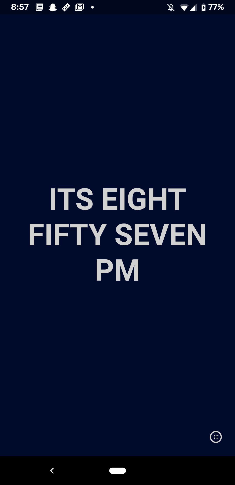
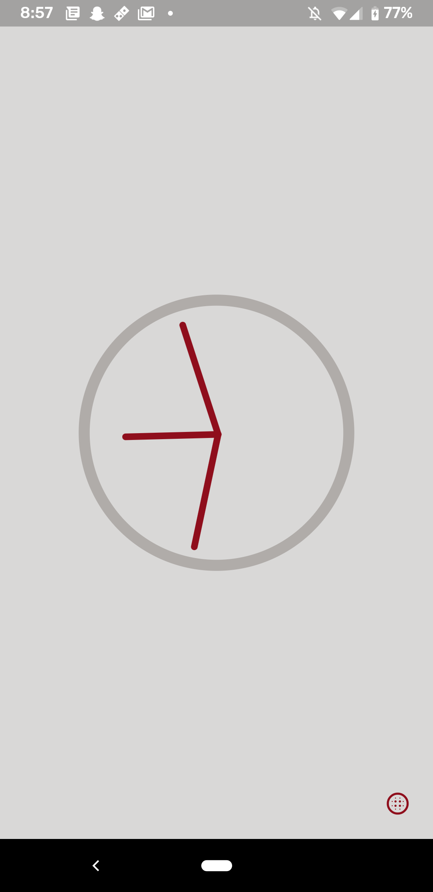
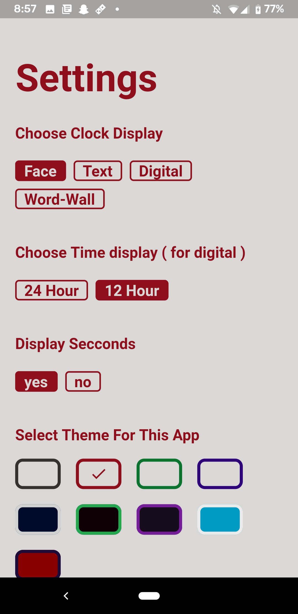
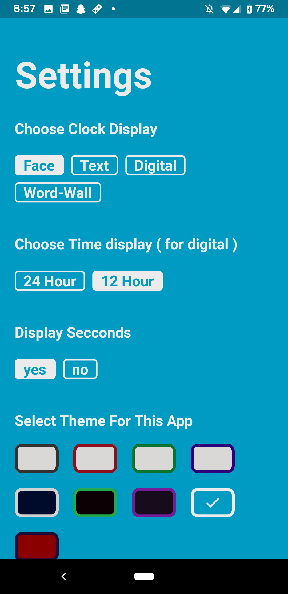
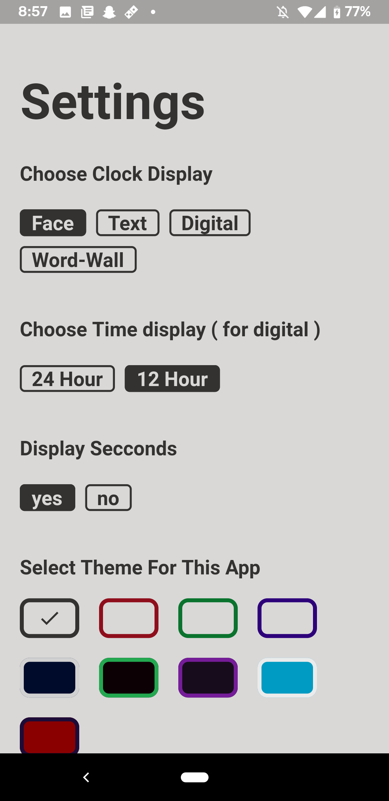

# Firefly

A insainly simple framework to make minimalist, themed, flutter apps in secconds

## Live App Examples

Clock App : [Google Play](https://play.google.com/store/apps/details?id=com.quiteSimply.clock)

## Example Images 

App pages made with the firefly widgets implementing minimalistic styles




Settings page `AUTOGENERATED` by appdata given to FireFly

Themes come built in and are reflected in all Firefly components






## How simple it is to implement

Below is the entire app boilerplate!

```dart
void main() async {

	dynamic appsettings = {
		'debug-mode' : true, // if savedata should be reset on boot-up

		// Each of these will define a peice of savedata for the app
		'app-data' : [
			{
				// Here a variable called 'clocktype' is created
				// Its automaticly added to the settings
				'name' : 'clockType',
				'default' : 'Text',
				'settings' : {
					'label' : 'Choose Clock Display',
					'options' : [ 'Face', 'Text', 'Digital', 'Word-Wall' ]
				}
			},
			{
				'name' : 'hourFormat',
				'default' : '12 Hour',
				'settings' : {
					'label' : 'Choose Time display ( for digital )',
					'options' : [ '24 Hour', '12 Hour' ]
				}
			},
			{
				'name' : 'showSecconds',
				'default' : 'yes',
				'settings' : {
					'label' : 'Display Secconds',
					'options' : [ 'yes', 'no' ]
				}
			}
		],
	};

	// Firefly will handle the whole app bootup,
	// Simply pass a dynamic for the settings aswell as a root widget
	runApp( await Firefly.Main.start(
		// Settings from above
		appsettings,
		// Some widget that runs your app
		Main(),
	));
	
}


```